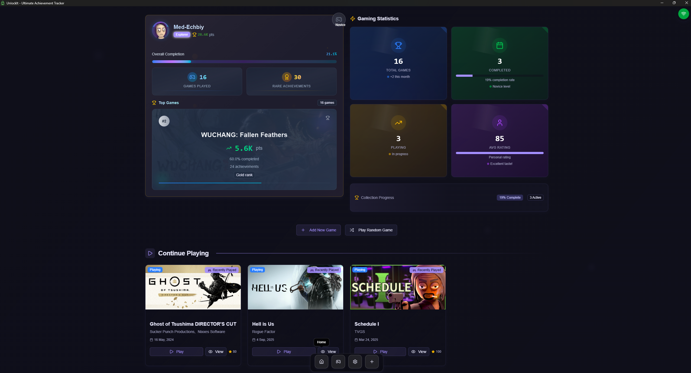
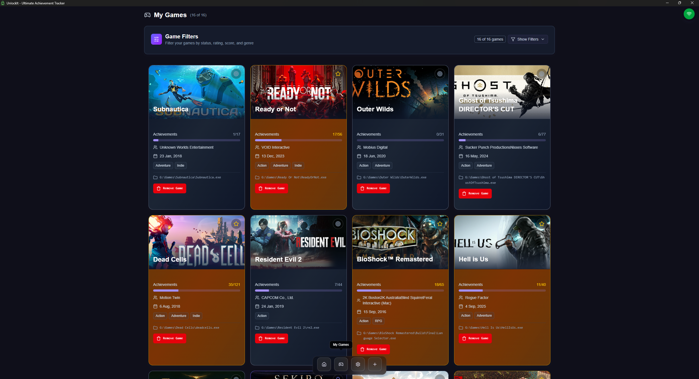
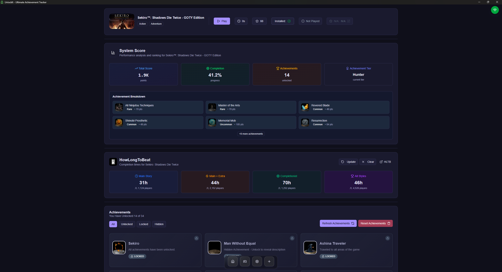
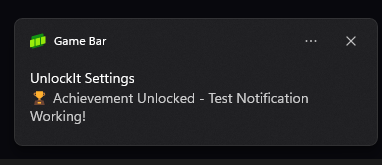

# 🎮 UnlockIt - Ultimate Achievement Tracker

[](https://opensource.org/licenses/MIT)
[](https://tauri.app/)
[](https://reactjs.org/)
[](https://www.typescriptlang.org/)
[](https://www.rust-lang.org/)
[](https://github.com/Med-Echbiy/UnlockIt/releases)

> **The ultimate achievement tracking application for PC gamers.** Track your progress, monitor playtime, unlock achievements, and enhance your gaming experience with detailed statistics and insights.

## 📸 Screenshots

<div align="center">
  
### 🏠 Home Dashboard


### 🎮 My Games Library



### 📊 Game Details & Achievements



### 🔔 Achievement Notifications



</div>

## 🌟 Features

### 🏆 Achievement Tracking

- **Real-time Achievement Monitoring**: Automatically tracks and unlocks achievements as you play
- **Universal Emulator Support**: Works with ALI213, RUNE, CODEX, ONLINE FIX, Goldberg, TENOKE, and Steam Config
- **Advanced Scoring System**: Comprehensive point-based ranking with 6-tier rarity system (Common to Mythic)
- **Progress Visualization**: Beautiful progress bars and statistics for each game
- **Achievement Details**: View achievement descriptions, unlock dates, and rarity information
- **Bulk Achievement Management**: Reset, sync, or manage achievements in bulk

### 🎮 Game Management

- **Steam Integration**: Seamlessly integrates with Steam games and metadata
- **Game Library**: Organize and manage your entire game collection
- **Playtime Tracking**: Automatic playtime monitoring for all your games
- **Game Statistics**: Detailed insights into your gaming habits

### 📊 Analytics & Insights

- **HowLongToBeat Integration**: Get estimated completion times for your games
- **Gaming Statistics**: Track your overall gaming progress and achievements
- **Visual Progress**: Beautiful charts and graphs of your gaming journey
- **Completion Tracking**: Monitor your game completion percentages

### 🏅 Advanced Scoring System

UnlockIt features a comprehensive scoring system that rewards players based on achievement rarity and gaming milestones:

#### Achievement Tier System

- **Mythic** (0-0.5% unlock rate): 1,000 base points - Ultra-rare achievements that few players have unlocked
- **Legendary** (0.5-3% unlock rate): 500 base points - Extremely rare and prestigious achievements
- **Epic** (3-10% unlock rate): 100 base points - Challenging achievements requiring skill or dedication
- **Rare** (10-25% unlock rate): 50 base points - Moderately difficult achievements
- **Uncommon** (25-50% unlock rate): 25 base points - Standard achievements with some challenge
- **Common** (50-100% unlock rate): 10 base points - Basic achievements most players earn

#### Player Ranking System

Progress through 7 distinct ranks based on your total score and completion percentage:

- **Novice** (0+ points, 0%+ completion): Just starting your gaming journey
- **Explorer** (1,000+ points, 20%+ completion): Beginning to explore gaming achievements
- **Hunter** (5,000+ points, 40%+ completion): Active achievement hunter
- **Master** (10,000+ points, 60%+ completion): Skilled player with solid achievements
- **Legend** (25,000+ points, 75%+ completion): Legendary achievements and high completion rates
- **Grandmaster** (50,000+ points, 90%+ completion): Elite gaming mastery
- **Touch Grass** (200,000+ points, 98%+ completion): Ultimate gaming mastery achieved. Time to go outside!

#### Bonus Multipliers

- **Rarity Bonuses**: Extra points for unlocking rare achievements within specific timeframes
- **Completion Streaks**: Bonus points for completing multiple games consecutively
- **Speed Bonuses**: Rewards for achieving 100% completion in record time
- **Difficulty Multipliers**: Enhanced scoring for games with notoriously challenging achievements (souls like games, etc.)

### 🔔 Notifications & Alerts

- **Achievement Notifications**: Get instant notifications when you unlock achievements
- **Custom Sounds**: Personalize notification sounds (Xbox, PlayStation, etc.)
- **Visual Celebrations**: Animated achievement unlock celebrations
- **Progress Milestones**: Notifications for important gaming milestones

### 🎨 User Experience

- **Modern UI**: Clean, intuitive interface built with React and Tailwind CSS
- **Smooth Animations**: Framer Motion powered animations for a delightful experience
- **Dark/Light Themes**: Support for both dark and light theme preferences
- **Responsive Design**: Perfect experience across different screen sizes

<!-- ## 🚀 Getting Started

### Prerequisites

Before you begin, ensure you have the following installed:

- [Node.js](https://nodejs.org/) (v18 or higher)
- [Rust](https://rustup.rs/) (latest stable)
- [pnpm](https://pnpm.io/) (recommended package manager)

### Installation

1. **Clone the repository**

   ```bash
   git clone https://github.com/Med-Echbiy/UnlockIt.git
   cd UnlockIt
   ```

2. **Install dependencies**

   ```bash
   pnpm install
   ```

3. **Setup Steam API Key** (Required for Steam integration)

   - Get your Steam API key from [Steam Web API](https://steamcommunity.com/dev/apikey)
   - Add it through the application settings

4. **Run the development server**

   ```bash
   pnpm tauri dev
   ```

5. **Build for production**
   ```bash
   pnpm tauri build
   ```

## 🛠️ Tech Stack

### Frontend

- **React 19** - Modern React with concurrent features
- **TypeScript** - Type-safe development experience
- **Tailwind CSS 4** - Utility-first CSS framework
- **Framer Motion** - Smooth animations and transitions
- **Zustand** - Lightweight state management
- **Radix UI** - Accessible UI components
- **Lucide React** - Beautiful icon library

### Backend

- **Tauri 2.0** - Secure, fast, and lightweight desktop framework
- **Rust** - High-performance backend operations
- **Reqwest** - HTTP client for API communications
- **Serde** - Serialization/deserialization
- **Tokio** - Async runtime for Rust

### Build Tools

- **Vite** - Lightning-fast build tool
- **pnpm** - Efficient package manager
- **TypeScript Compiler** - Type checking and compilation

## 📁 Project Structure

```
UnlockIt/
├── src/                          # Frontend source code
│   ├── components/               # React components
│   │   ├── main/                # Main application components
│   │   │   ├── Game/            # Game-related components
│   │   │   ├── Home/            # Home page components
│   │   │   ├── Settings/        # Settings components
│   │   │   └── shared/          # Shared components
│   │   └── ui/                  # UI component library
│   ├── animation-ui/            # Custom animation components
│   ├── hooks/                   # React hooks
│   ├── lib/                     # Utility libraries
│   ├── store/                   # Zustand state stores
│   ├── types/                   # TypeScript type definitions
│   └── workflow/                # Business logic workflows
├── src-tauri/                   # Tauri backend source
│   ├── src/                     # Rust source code
│   ├── icons/                   # Application icons
│   └── capabilities/            # Tauri capabilities
└── public/                      # Static assets
``` -->

## ⚙️ Configuration

### Steam Integration

1. Obtain a Steam Web API key from [here](https://steamcommunity.com/dev/apikey)
2. Open UnlockIt settings
3. Enter your Steam API key
4. Start adding games to your library

## 📖 Guide

### Supported Emulators

UnlockIt currently supports the following Steam emulators for achievement tracking:

- **ALI213** - Full support for achievement tracking and playtime monitoring
- **RUNE** - Compatible with most games and features
- **CODEX** - Works with achievement unlocking and progress tracking (dual location support)
- **ONLINE_FIX** - Supports online features and achievement synchronization
- **Steam Config** - Native Steam configuration file support
- **Goldberg SteamEmu** - JSON/INI format support for comprehensive game compatibility
- **TENOKE** - 🆕 Latest addition with TENOKE.ini configuration file support

### Adding Games with Emulators

#### Method 1: Direct Game Addition

1. Launch UnlockIt
2. Click "Add Game" or use the "+" button
3. Navigate to your game's installation folder
4. Select the game executable
5. UnlockIt will automatically detect supported emulators

#### Method 2: Emulator Compatibility Fix

If your game doesn't appear or isn't working properly with UnlockIt:

**Step 1: Use SteamAutoCracker Tool**

1. Download **SteamAutoCracker** from: [https://github.com/BigBoiCJ/SteamAutoCracker/releases/tag/2.2.1-gui](https://github.com/BigBoiCJ/SteamAutoCracker/releases/tag/2.2.1-gui)
2. Extract the downloaded archive to a convenient location
3. Run `SteamAutoCracker.exe` as administrator
4. In the application:
   - Browse and select your game's executable file
   - Choose **ALI213** as the crack type
   - Click "Crack" to apply the emulator files
5. The tool will automatically generate and place the necessary files:
   - `steam_api.dll`
   - `steam_api64.dll`
   - `valve.ini` or `steamConfig.ini`

**Step 2: Test Game Launch**

1. Try launching your game
2. If the game launches successfully, you can now add it to UnlockIt
3. UnlockIt should now be able to track achievements and playtime

**Step 3: Rollback if Needed**
If the game fails to launch after applying the crack:

1. Delete the generated emulator files:
   - `steam_api.dll`
   - `steam_api64.dll`
   - `valve.ini` or `steamConfig.ini`
2. Rename `steam_api.dll.bak` back to `steam_api.dll`
3. This means the game is not currently supported 😢

### Troubleshooting

#### Game Not Detected

- Ensure you're pointing to the correct game executable

#### Achievements Not Tracking

- Make sure UnlockIt is running before launching the game
- Check that the game is added to your UnlockIt library

#### Game Won't Launch

- Follow the rollback steps above to restore original files
- Try running the game as administrator
- Check Windows Defender or antivirus settings (emulator files might be flagged)
- Ensure SteamAutoCracker was run as administrator

### Best Practices

1. **Always backup original files** before applying any emulator cracks
2. **Use SteamAutoCracker as administrator** for best results
3. **Test one game at a time** when applying emulator changes
4. **Keep UnlockIt running** while playing games for proper tracking
5. **Check compatibility** before purchasing 😂 or installing new games

<!-- ### Notification Settings

- Configure achievement notification sounds
- Customize notification appearance
- Set up achievement tracking preferences -->

<!-- ## 🤝 Contributing

We welcome contributions! Here's how you can help:

1. **Fork the repository**
2. **Create a feature branch**: `git checkout -b feature/amazing-feature`
3. **Make your changes**: Follow our coding standards and best practices
4. **Test thoroughly**: Ensure your changes don't break existing functionality
5. **Commit your changes**: `git commit -m 'Add some amazing feature'`
6. **Push to the branch**: `git push origin feature/amazing-feature`
7. **Open a Pull Request**

### Development Guidelines

- Follow TypeScript/Rust best practices
- Write meaningful commit messages
- Add tests for new features
- Update documentation as needed
- Ensure code is properly formatted

### Bug Reports

When reporting bugs, please include:

- OS and version
- UnlockIt version
- Steps to reproduce
- Expected vs actual behavior
- Relevant logs or screenshots

## 📋 Roadmap

### Short Term (v1.0)

- [x] Steam achievement tracking
- [x] Playtime monitoring
- [x] Basic game management
- [x] Achievement notifications
- [ ] Achievement statistics dashboard
- [ ] Better error handling and logging

### Medium Term (v1.5)

- [ ] Epic Games Store integration
- [ ] GOG integration
- [ ] Cloud save synchronization
- [ ] Social features and leaderboards
- [ ] Achievement sharing
- [ ] Custom achievement categories

### Long Term (v2.0)

- [ ] Mobile companion app
- [ ] Web dashboard
- [ ] Multi-platform sync
- [ ] Advanced analytics
- [ ] Community features
- [ ] Plugin system for additional platforms

## 🔧 System Requirements

### Minimum Requirements

- **OS**: Windows 10, macOS 10.15, or Linux (Ubuntu 18.04+)
- **RAM**: 2 GB
- **Storage**: 500 MB free space
- **Network**: Internet connection for Steam integration

### Recommended Requirements

- **OS**: Windows 11, macOS 12+, or Linux (Ubuntu 20.04+)
- **RAM**: 4 GB or more
- **Storage**: 1 GB free space
- **Network**: Broadband internet connection

## 🐛 Known Issues

- Steam Deck compatibility is experimental
- Some achievements may not track properly with older games
- Large game libraries may cause slower initial loading

## 📄 License

This project is licensed under the MIT License - see the [LICENSE](LICENSE) file for details.

## ❤️ Support

If you love UnlockIt and want to support its development:

[](https://www.patreon.com/your-patreon-link)

Your support helps us:

- 🚀 Develop new features faster
- 🐛 Fix bugs and improve stability
- 🎮 Add support for more gaming platforms
- 📱 Create companion apps
- 🌟 Keep the project free and open source

## 🙏 Acknowledgments

- **Steam** for providing the Web API
- **HowLongToBeat** for game completion time data
- **Tauri Team** for the amazing desktop framework
- **React Team** for the excellent frontend library
- **All contributors** who help make UnlockIt better

## 📞 Contact & Links

- **GitHub**: [Med-Echbiy/UnlockIt](https://github.com/Med-Echbiy/UnlockIt)
- **Issues**: [Report a bug or request a feature](https://github.com/Med-Echbiy/UnlockIt/issues)
- **Discussions**: [Join our community discussions](https://github.com/Med-Echbiy/UnlockIt/discussions)
- **Email**: [Contact the maintainer](mailto:your-email@example.com)

## Recommended IDE Setup

- [VS Code](https://code.visualstudio.com/) + [Tauri](https://marketplace.visualstudio.com/items?itemName=tauri-apps.tauri-vscode) + [rust-analyzer](https://marketplace.visualstudio.com/items?itemName=rust-lang.rust-analyzer)

---

<div align="center">
  <strong>🎮 Happy Gaming! 🏆</strong>
  <br>
  <em>Made with ❤️ by Mohamed Echbiy</em>
</div> -->
